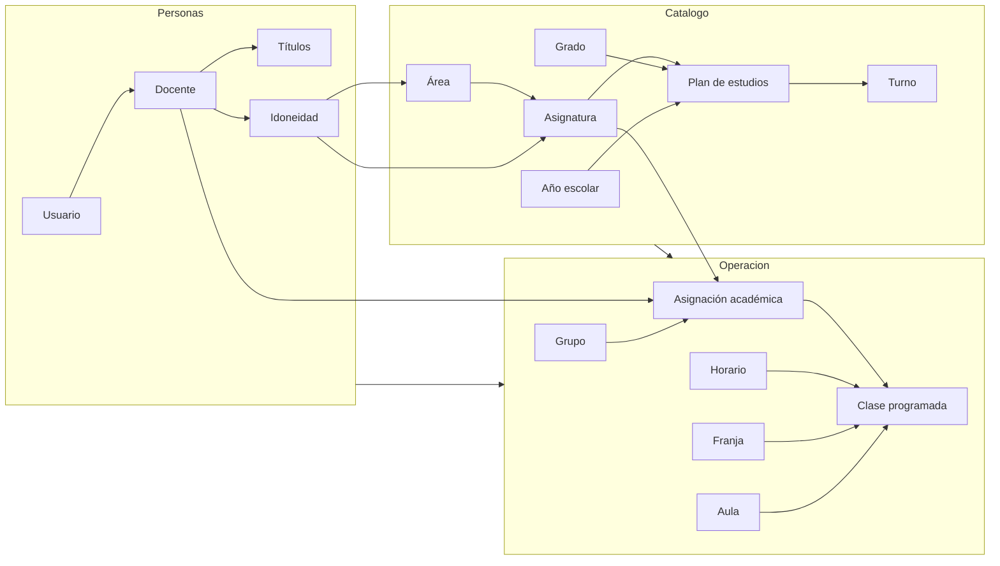

# Diagrama entidad-relación — Gestión de Horarios I.E.R. Yarumito

Modelo conceptual acorde a las reglas del negocio y a las decisiones de alcance:

- Asignación manual del rector con validación de reglas
- Versionado por año escolar (borrador / publicado)
- Área → Asignatura → Plan de estudios
- Sin estudiantes (solo grupos)
- Aulas con validación de choque
- Media técnica como asignatura especial de 10.º y 11.º en contrajornada
- Idoneidad: títulos + decreto + tabla explícita
- Compensación con actividades institucionales
- Roles: rector y docente
- Auditoría de cambios

---

## Vista general (Mermaid)

```mermaid
erDiagram
    %% ===== ACCESO =====
    USUARIO ||--o| DOCENTE : "perfil"
    DOCENTE ||--o{ TITULO_PROFESIONAL : "posee"
    DOCENTE ||--o{ IDONEIDAD : "habilitado_por"
    AREA ||--o{ DOCENTE : "area_nombramiento"
    AREA ||--o{ IDONEIDAD : "cubre"
    ASIGNATURA ||--o{ IDONEIDAD : "cubre_opcional"
    TITULO_PROFESIONAL ||--o{ IDONEIDAD : "soporta"

    %% ===== CATÁLOGO ACADÉMICO =====
    AREA ||--o{ ASIGNATURA : "contiene"
    ANIO_ESCOLAR ||--o{ PLAN_ESTUDIOS : "vigente_en"
    GRADO ||--o{ PLAN_ESTUDIOS : "define"
    ASIGNATURA ||--o{ PLAN_ESTUDIOS : "intensidad"
    TURNO ||--o{ PLAN_ESTUDIOS : "en_turno"

    ANIO_ESCOLAR ||--o{ GRUPO : "tiene"
    GRADO ||--o{ GRUPO : "agrupa"
    SEDE ||--o{ GRUPO : "ubicado_en"
    DOCENTE ||--o{ GRUPO : "dirige"
    AULA ||--o| GRUPO : "aula_fija"

    %% ===== TIEMPO Y ESPACIO =====
    TURNO ||--o{ FRANJA_HORARIA : "compone"
    SEDE ||--o{ AULA : "tiene"

    %% ===== ASIGNACIÓN Y HORARIO =====
    ANIO_ESCOLAR ||--o{ ASIGNACION_ACADEMICA : "vigente_en"
    DOCENTE ||--o{ ASIGNACION_ACADEMICA : "dicta"
    GRUPO ||--o{ ASIGNACION_ACADEMICA : "recibe"
    ASIGNATURA ||--o{ ASIGNACION_ACADEMICA : "de"

    ANIO_ESCOLAR ||--o{ HORARIO : "versiona"
    SEDE ||--o{ HORARIO : "de"
    USUARIO ||--o{ HORARIO : "crea"
    HORARIO ||--o{ CLASE_PROGRAMADA : "incluye"
    ASIGNACION_ACADEMICA ||--o{ CLASE_PROGRAMADA : "ubica"
    FRANJA_HORARIA ||--o{ CLASE_PROGRAMADA : "en"
    AULA ||--o{ CLASE_PROGRAMADA : "ocupa"

    ANIO_ESCOLAR ||--o{ ACTIVIDAD_INSTITUCIONAL : "tiene"
    ACTIVIDAD_INSTITUCIONAL ||--o{ ASIGNACION_ACTIVIDAD : "asignada"
    DOCENTE ||--o{ ASIGNACION_ACTIVIDAD : "compensa"

    %% ===== CONTROL =====
    DOCENTE ||--o{ RESTRICCION_DOCENTE : "restringe"
    ANIO_ESCOLAR ||--o{ RESTRICCION_DOCENTE : "vigente_en"
    FRANJA_HORARIA ||--o{ RESTRICCION_DOCENTE : "bloquea"
    ANIO_ESCOLAR ||--o{ PARAMETRO_INSTITUCIONAL : "configura"
    HORARIO ||--o{ CONFLICTO : "detecta"
    USUARIO ||--o{ REGISTRO_AUDITORIA : "genera"

    USUARIO {
        uuid id PK
        string correo UK
        string contrasena_hash
        enum rol "RECTOR | DOCENTE"
        boolean activo
        datetime ultimo_acceso
    }

    DOCENTE {
        uuid id PK
        uuid usuario_id FK_UK
        string nombres
        string apellidos
        string tipo_documento
        string numero_documento UK
        string telefono
        string correo_institucional
        enum tipo_vinculacion
        uuid area_nombramiento_id FK
        string numero_decreto
        date fecha_decreto
        string escalafon
        int horas_semanales_contratadas "default 22"
        int max_horas_extra "default 10"
        boolean es_exclusivo_media_tecnica
        enum estado
        date fecha_vinculacion
    }

    TITULO_PROFESIONAL {
        uuid id PK
        uuid docente_id FK
        enum nivel
        string nombre_titulo
        string institucion
        int anio_graduacion
        string archivo_soporte
    }

    IDONEIDAD {
        uuid id PK
        uuid docente_id FK
        uuid area_id FK
        uuid asignatura_id FK "nullable"
        enum tipo "PRINCIPAL | AUTORIZADA | EXCEPCIONAL"
        uuid titulo_soporte_id FK "nullable"
        text justificacion
        date vigente_desde
        date vigente_hasta "nullable"
        uuid aprobada_por FK "nullable"
    }

    ANIO_ESCOLAR {
        uuid id PK
        int anio
        date fecha_inicio
        date fecha_fin
        enum estado
        boolean es_actual
    }

    SEDE {
        uuid id PK
        string nombre
        string codigo UK
        string direccion
        boolean es_principal
    }

    AREA {
        uuid id PK
        string nombre
        string codigo UK
        boolean obligatoria
        boolean solo_media
        boolean activa
    }

    ASIGNATURA {
        uuid id PK
        uuid area_id FK
        string nombre
        string codigo UK
        string abreviatura
        string color_ui
        boolean exige_idoneidad_estricta
        boolean es_media_tecnica
        boolean requiere_docente_exclusivo
        enum tipo_aula_requerida
        int max_clases_consecutivas "default 2"
        boolean activa
    }

    GRADO {
        uuid id PK
        int nivel "6..11"
        string nombre
        boolean es_media
        int prioridad_asignacion
        int horas_semanales_esperadas "30 o 37"
    }

    GRUPO {
        uuid id PK
        string codigo "601, 1102..."
        uuid grado_id FK
        uuid anio_escolar_id FK
        uuid sede_id FK
        uuid director_grupo_id FK "nullable"
        int cantidad_estudiantes
        uuid aula_fija_id FK "nullable"
        boolean activo
    }

    PLAN_ESTUDIOS {
        uuid id PK
        uuid anio_escolar_id FK
        uuid grado_id FK
        uuid asignatura_id FK
        int horas_semanales
        uuid turno_id FK
        text observacion
    }

    TURNO {
        uuid id PK
        string nombre "Mañana | Contrajornada"
        time hora_inicio
        time hora_fin
        int duracion_clase_minutos
        int clases_por_dia
        int clases_antes_de_descanso
        int duracion_descanso_minutos
    }

    FRANJA_HORARIA {
        uuid id PK
        uuid turno_id FK
        int numero
        time hora_inicio
        time hora_fin
        boolean es_descanso
        decimal horas_academicas_equivalentes "1 mañana, 4 tarde"
        int orden
    }

    AULA {
        uuid id PK
        uuid sede_id FK
        string nombre
        enum tipo "AULA | LABORATORIO | SALA_SISTEMAS | CANCHA"
        int capacidad
        boolean activa
    }

    ASIGNACION_ACADEMICA {
        uuid id PK
        uuid anio_escolar_id FK
        uuid docente_id FK
        uuid grupo_id FK
        uuid asignatura_id FK
        int horas_semanales
        int horas_extra
        enum estado
        text observacion
        uuid asignada_por FK
        datetime fecha_asignacion
    }

    HORARIO {
        uuid id PK
        uuid anio_escolar_id FK
        uuid sede_id FK
        int version
        string nombre
        enum estado "BORRADOR | PUBLICADO | ARCHIVADO"
        datetime fecha_publicacion "nullable"
        uuid creado_por FK
        text notas
    }

    CLASE_PROGRAMADA {
        uuid id PK
        uuid horario_id FK
        uuid asignacion_academica_id FK
        enum dia "LUN..VIE"
        uuid franja_horaria_id FK
        uuid aula_id FK
        boolean es_hora_extra
        boolean bloqueada
    }

    ACTIVIDAD_INSTITUCIONAL {
        uuid id PK
        uuid anio_escolar_id FK
        string nombre
        enum tipo
        text descripcion
        int horas_semanales
    }

    ASIGNACION_ACTIVIDAD {
        uuid id PK
        uuid docente_id FK
        uuid actividad_id FK
        int horas_semanales
        text justificacion
    }

    RESTRICCION_DOCENTE {
        uuid id PK
        uuid docente_id FK
        uuid anio_escolar_id FK
        enum dia
        uuid franja_horaria_id FK
        enum tipo "NO_DISPONIBLE | PREFERENTE"
        text motivo
        string documento_soporte
        uuid aprobada_por FK
    }

    PARAMETRO_INSTITUCIONAL {
        uuid id PK
        uuid anio_escolar_id FK
        string clave
        string valor
        string tipo_dato
        text descripcion
    }

    CONFLICTO {
        uuid id PK
        uuid horario_id FK
        enum tipo
        enum severidad "ERROR | ADVERTENCIA"
        text mensaje
        boolean resuelto
        datetime fecha_deteccion
    }

    REGISTRO_AUDITORIA {
        uuid id PK
        uuid usuario_id FK
        string accion
        string entidad
        uuid id_entidad
        json datos_antes
        json datos_despues
        datetime fecha
        string ip
    }
```

---

## Unicidades críticas (integridad de negocio)

| Entidad | Unicidad | Regla que protege |
|---------|----------|-------------------|
| `ASIGNACION_ACADEMICA` | `(anio_escolar, grupo, asignatura)` | Una materia de un grupo la dicta un solo docente |
| `PLAN_ESTUDIOS` | `(anio_escolar, grado, asignatura)` | Una sola intensidad horaria por materia/grado/año |
| `CLASE_PROGRAMADA` | `(horario, grupo*, dia, franja)` | Un grupo no tiene dos clases a la vez |
| `CLASE_PROGRAMADA` | `(horario, docente*, dia, franja)` | Un docente no está en dos sitios a la vez |
| `CLASE_PROGRAMADA` | `(horario, aula, dia, franja)` | Un aula no se usa dos veces a la vez |
| `GRUPO` | `(anio_escolar, codigo)` | Códigos únicos por año (601, 1102…) |
| `HORARIO` | `(anio_escolar, sede, version)` | Versiones claras por sede y año |

\* Grupo y docente se obtienen vía `ASIGNACION_ACADEMICA`, no se duplican en `CLASE_PROGRAMADA`.

---

## Flujos clave del dominio



---

## Notas de diseño (media técnica y carga)

1. **Media técnica** no crea grupos propios: son los mismos `10°`, `1101` y `1102`. En `PLAN_ESTUDIOS` la asignatura con `es_media_tecnica = true` apunta al turno **Contrajornada**.
2. **`FRANJA_HORARIA.horas_academicas_equivalentes`**: mañana ≈ 1; bloque tarde 1:30–5:30 ≈ 4. Así la carga de un docente (p. ej. 26 h de Deymer) cuadra.
3. **Carga semanal docente** = suma de horas de `CLASE_PROGRAMADA` (ponderadas) + `ASIGNACION_ACTIVIDAD`. Se compara con `PARAMETRO_INSTITUCIONAL` (22 h / máx. 10 extras).
4. **Carga del estudiante** = suma de `PLAN_ESTUDIOS` del grado (30 h bachillerato / 37 h con media técnica).
```
